<!--
  ─────────────────────────────────────────────────────────────
  Mohamed Ismail · GitHub profile README
  Repo: github.com/realdreamer/realdreamer   (repo name == username)
  Assets live in ./assets — keep them, they are self-hosted (no CDN).
  See SETUP.md for the 5-minute install + the GitHub Actions.
  ─────────────────────────────────────────────────────────────
-->

<p align="center">
  <picture>
    <source media="(prefers-color-scheme: dark)" srcset="./assets/banner-dark.svg">
    <source media="(prefers-color-scheme: light)" srcset="./assets/banner-light.svg">
    
  </picture>
</p>

<p align="center">
  <a href="https://www.mohamedismail.dev/"></a>
  <a href="https://www.linkedin.com/in/mohamed-ismail-mo/"></a>
  <a href="https://dev.to/realdreamer"></a>
  <a href="https://codepen.io/realdreamer"></a>
  <a href="https://leetcode.com/realdreamer"></a>
  <a href="mailto:ismailreality1@gmail.com"></a>
</p>

<p align="center">
  
  
  
</p>

---

## `$ whoami`

```ts
const mohamed = {
  role:      "Senior Fullstack Engineer @ Nationale-Nederlanden",
  based:     "Uithoorn, Netherlands 🇳🇱",
  building:  ["fullstack architecture", "React/TypeScript platform tooling", "API integrations"],
  stack:     ["TypeScript", "React", "Next.js", "Node.js", "GraphQL", "AWS Serverless"],
  practice:  ["hexagonal (ports & adapters)", "spec-driven development", "CI/CD"],
  exploring: ["Web3", "AWS", "home automation"],
  nextStep:  "team lead & mentoring — helping junior devs grow is my favourite part of the job",
  reach:     "ismailreality1@gmail.com",
} as const;
```

<table>
<tr>
<td width="50%" valign="top">

### 🤝 Let's build something

I'm happy to pair, review, or co-maintain. Especially interested in:

- **React / React Native** side projects
- **GraphQL** schema & federation work
- **Serverless AWS** (Lambda · API Gateway · DynamoDB)
- **Developer tooling** and design-system plumbing
- **Open-source maintainers** who need a second reviewer

</td>
<td width="50%" valign="top">

### 🧭 How I work

- Hexagonal architecture — domain first, adapters last
- Spec-driven: the contract before the code
- Small PRs, real reviews, no rubber stamps
- Docs and tests count as "done"
- I mentor, and I like being mentored

</td>
</tr>
</table>

---

## 🧰 Toolbox

<table>
  <tr>
    <td width="190"><b>Languages &amp; runtime</b></td>
    <td>
      
      
      
    </td>
  </tr>
  <tr>
    <td width="190"><b>Frontend</b></td>
    <td>
      
      
      
    </td>
  </tr>
  <tr>
    <td width="190"><b>APIs &amp; auth</b></td>
    <td>
      
      
    </td>
  </tr>
  <tr>
    <td width="190"><b>Cloud &amp; delivery</b></td>
    <td>
      
      
      
      
      
    </td>
  </tr>
  <tr>
    <td width="190"><b>Build &amp; code quality</b></td>
    <td>
      
      
      
      
      
    </td>
  </tr>
  <tr>
    <td width="190"><b>Monorepo</b></td>
    <td>
      
      
    </td>
  </tr>
  <tr>
    <td width="190"><b>Testing</b></td>
    <td>
      
      
      
    </td>
  </tr>
  <tr>
    <td width="190"><b>AI-assisted workflow</b></td>
    <td>
      
      
      
    </td>
  </tr>
</table>

<sub>Also fluent in: REST · CI/CD · hexagonal (ports &amp; adapters) · spec-driven development</sub>

---

## 📊 The numbers

<p align="center">
  <picture>
    <source media="(prefers-color-scheme: dark)" srcset="https://github-readme-stats.vercel.app/api?username=realdreamer&show_icons=true&include_all_commits=true&count_private=true&rank_icon=github&show=reviews,prs_merged,prs_merged_percentage&hide_title=true&bg_color=0B0E14&title_color=4CE0B3&text_color=8B99A8&icon_color=4CE0B3&border_color=1E2633&border_radius=12">
    
  </picture>
  <picture>
    <source media="(prefers-color-scheme: dark)" srcset="https://streak-stats.demolab.com?user=realdreamer&hide_border=false&border=1E2633&background=0B0E14&stroke=1E2633&ring=4CE0B3&fire=4CE0B3&currStreakNum=E6EDF3&sideNums=E6EDF3&currStreakLabel=4CE0B3&sideLabels=8B99A8&dates=8B99A8&border_radius=12">
    
  </picture>
</p>

<p align="center">
  <picture>
    <source media="(prefers-color-scheme: dark)" srcset="https://github-readme-stats.vercel.app/api/top-langs/?username=realdreamer&layout=compact&langs_count=8&hide=html,css&bg_color=0B0E14&title_color=4CE0B3&text_color=8B99A8&border_color=1E2633&border_radius=12">
    
  </picture>
</p>

> <sub>Cards count **all** public commits plus private-contribution totals, and include merged-PR and code-review counts — the review number is the one I'm proudest of.</sub>

---

## 🏆 Trophy cabinet

<p align="center">
  
</p>

---

## 📈 A year of shipping

<p align="center">
  <picture>
    <source media="(prefers-color-scheme: dark)" srcset="https://github-readme-activity-graph.vercel.app/graph?username=realdreamer&custom_title=Contribution%20activity%20%E2%80%94%20last%2090%20days&days=90&bg_color=0B0E14&color=E6EDF3&line=4CE0B3&point=58A6FF&title_color=4CE0B3&area=true&area_color=4CE0B3&hide_border=true&radius=12">
    
  </picture>
</p>

<p align="center">
  <picture>
    <source media="(prefers-color-scheme: dark)" srcset="https://raw.githubusercontent.com/realdreamer/realdreamer/output/github-snake-dark.svg">
    <source media="(prefers-color-scheme: light)" srcset="https://raw.githubusercontent.com/realdreamer/realdreamer/output/github-snake.svg">
    
  </picture>
</p>

---

## ⚡ Recently

<!--START_SECTION:activity-->
1. ⬆️ Pushed commits to `master` in [realdreamer/mojs](https://github.com/realdreamer/mojs)
<!--END_SECTION:activity-->

---

<!-- ## 📌 Worth a look -->

<!--
  Swap these two repo names for whatever you want pinned up front.
  Duplicate the block for more.
-->
<!--
<p align="center">
  <a href="https://github.com/realdreamer/REPO-ONE">
    
  </a>
  <a href="https://github.com/realdreamer/REPO-TWO">
    
  </a>
</p>
-->
---

<p align="center">
  <picture>
    <source media="(prefers-color-scheme: dark)" srcset="./assets/signature-dark.svg">
    <source media="(prefers-color-scheme: light)" srcset="./assets/signature-light.svg">
    
  </picture>
</p>

<p align="center"><sub><i>Got an idea, a gnarly PR, or a junior dev who needs a mentor? <a href="mailto:ismailreality1@gmail.com">Mail me</a>.</i></sub></p>
